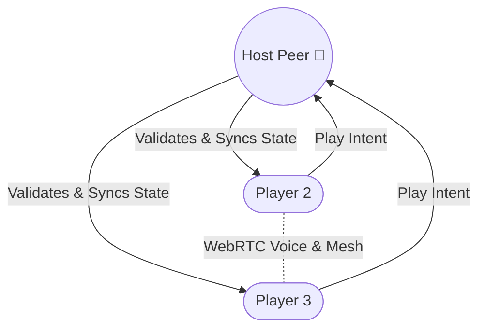

# UNO P2P

A serverless, peer-to-peer multiplayer UNO game playable directly in the browser.

UNO P2P allows friends to join a game room using a simple code, communicate via built-in voice chat, and play UNO without requiring any central game server to host the match. It uses a Host-Authoritative model over a Peer-to-Peer WebRTC Mesh to keep game state perfectly synchronized across all clients without a dedicated backend.

## Architecture



## Features

* **Serverless Multiplayer:** Uses WebRTC (via Trystero and BitTorrent trackers) for peer discovery and low-latency P2P data connections.
* **Host-Authoritative State:** Deterministically elects a host among connected peers to handle official rules, game state, and prevent desync.
* **Voice Chat:** Built-in WebRTC audio streaming to talk with friends while playing.
* **Procedural Graphics:** Cards are drawn purely using Canvas Graphics in Phaser (no external images required).

## Tech Stack

* **Game Engine:** Phaser 3
* **Networking:** Trystero (`@trystero-p2p/torrent`) WebRTC wrapper
* **Bundler:** Vite

## Getting Started

You need Node.js (v18+ recommended) installed.

1. Install the dependencies:
   ```bash
   npm install
   ```

2. Start the development server:
   ```bash
   npm run dev
   ```

3. Build for production:
   ```bash
   npm run build
   ```

## Usage

1. Open the game in your browser (`http://localhost:5173/` or the provided local URL).
2. Click **Create Room** and get a room code.
3. Have friends navigate to the same URL, enter the room code, and click **Join Room**.
4. To test locally, open two browser windows (or an Incognito window) and join the same room code.
5. The host can start the game once everyone is in.

## Project Structure

```text
├── src/
│   ├── scenes/
│   │   ├── BootScene.js   # Preloads assets & draws card textures
│   │   ├── LobbyScene.js  # P2P room joining & host election
│   │   ├── GameScene.js   # Main game loop, rendering & syncing
│   │   └── EndScene.js    # Game over screen
│   ├── network.js         # WebRTC singleton (Trystero)
│   ├── uno-engine.js      # Pure UNO game rules and state logic
│   ├── sounds.js          # Audio manager (lazy-loaded for mobile)
│   ├── voice-ui.js        # Voice chat UI logic
│   └── main.js            # Phaser entry point
```

## License

No license specified.
